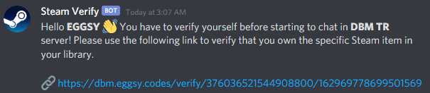
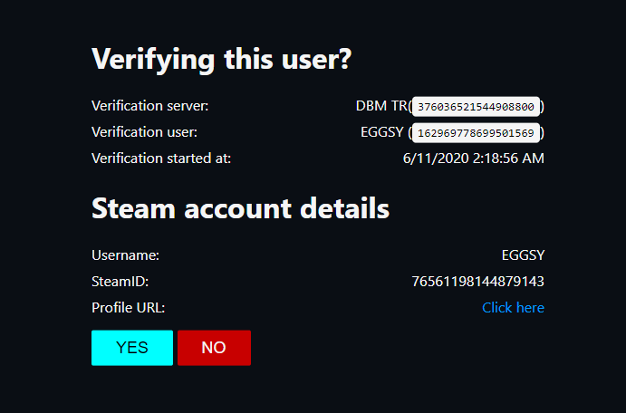

## Discord Steam Verification

> 🚧 This bot has **power** to kick or ban your useres if they can't verify themselves. Please use it on your own risk and make sure to run some tests before using it on your server!

> Please make sure to read all of the README.md (this) file before starting to use the bot.

Verify your Discord server members and check if they have specified app on their Steam library! Give them roles on successfull verification and punish them if they don't have it in their library!

### 🔥 Features

- [x] Steam authentication; users will be asked to login to their Steam account to check their library.
- [x] Everything is customizable!
  - Access to string files easily and **translate** the entire bot, API and website to your language!
  - **Multiple roles** that will be given to user on successfull login!
  - **Custom punishments** for users who doesn't have the specified app in their Steam library! You can choose between two options, **kick** or **ban** the user if they are trying to access your server without having the required app/game!
- [x] API and website ready for production! Specially designed API, multiple endpoints, Steam authentication and simple website UI.
- [x] Huge list of commands! You get `bypass`, `emit`, `isverified`, `list`, `reverify` and `unverify` commands built-in as well as usual commands such as `disable`, `enable`, `eval` and `help`!
  - `bypass`: Manually skip the verification process for someone!
  - `disable`: Disable the bot, this will stop verification process' on new member join and **clear the verification queue**.
  - `emit` or `verifyself`: This will start the verification for the message author, **don't forget** if a user has all of the success roles, they won't be able to use this command unless you remove their roles or use the `unverify` command.
  - `enable`: Enables the bot and starts verification process for every new user.
  - `eval`: Evaluates a JavaScript code. Only those with higher possible permission (Administrator) is able to use this command.
  - `help`: List of commands and their explanations, more explenation if a command name included after the command.
  - `isverified`: Check if a user has all the success roles that is specified in your config.
  - `list`: Lists all users waiting in the queue for verification.
  - `reverify`: Removes all the success roles and starts the verification process for specified user.
  - `unverify`: Removes all the success roles from user.

### ❓ How does it work?

There's an API and bot, always in communicate with each other, they keep the data in a main class and reads data from there so everything is synced between bot and API.

When a user joins to your server, bot will check if they _somehow_ got the sucess roles. If they have it, bot won't do anything. But if they don't have the specified roles, it'll start the verification process and send the user a message including your API's URL.

  

The user will be asked to login to their Steam account and then they'll see this page:

  

The time they click "Yes", they'll send a POST request to another route and it'll send a request to Steam's API to get user's games list, and it'll try to find the specified application ID in user's library.

If API finds the application in their library, it'll fire a successfull verification event so bot will get the signal and continue the progress. If user doesn't have the game, same way API will fire a failure event and bot will check your penalty settings. It'll kick the user if it's set to kick and it'll ban the user if it's set to ban. Don't worry, you can choose not to do anything or bypass the user with `bypass` command.

If API can't reach the data, it'll show an error box to the user with the message you specified to tell them that they got some issues with their profile (it's mostly caused when profile is set to private). **YES** user needs to have a public Steam profile so bot API can check the user's library.

That's all, but please do not forget this is not the "best version" of what you want. You may be looking for a better product but you're very welcome to contribute! I'll be looking forward to your pull request and bug reports! Please feel free to get in contact with me from [my website](https://eggsy.codes) and check out m other projects too!

> ⚠ ⚠ ⚠ **Caution!** ⚠⚠⚠
> This project has no database so all of you could easily setup and start using it, you can edit your clone to have a database or wait for me to create another branch with a version that includes database connection. **Your verification queue will be lost** when you restart the bot or something happens. **And your settings won't be available** until you restart the bot! So make sure to set your config and everything, test it on a private server and then start using it on your main server!

### 🛠 Requirements

This bot requires [Node.JS](https://nodejs.org/en/download/), [TypeScript](https://www.npmjs.com/package/typescript), [Yarn](https://www.npmjs.com/package/yarn), a [Discord Bot Application](https://discord.com/developers/applications/), [Steam API Key](https://steamcommunity.com/dev/registerkey) and a Node.JS hosting service (required so you can run API and the bot somewhere) to work. Please make sure you have them all installed globally.

### 📩 Installation

Make sure you have all the required programs and modules installed before this step!

- Clone this repository: `git clone https://github.com/eggsywashere/discord-steam-verification`
- Install modules with `yarn`
  - `cd` to your clone folder.
  - Type `yarn` in your terminal.
- Edit the `config.ts` file in `src/` directory as you wish.
- Copy the content of `.env.example`, fill the fields and rename it to `.env` (all fields are explained in comments, **make sure to** put the right app ID).
- Start the bot in **development** or **production** mode.
  - For development, type this in your terminal: `yarn dev`
  - For production, follow these steps:
    - Compile the code with: `yarn compile`
    - Start the compiled code: `yarn start`

You will now have your very own `discord-steam-verification` bot and API running! Invite your bot to your server and it'll start verifying new users!
